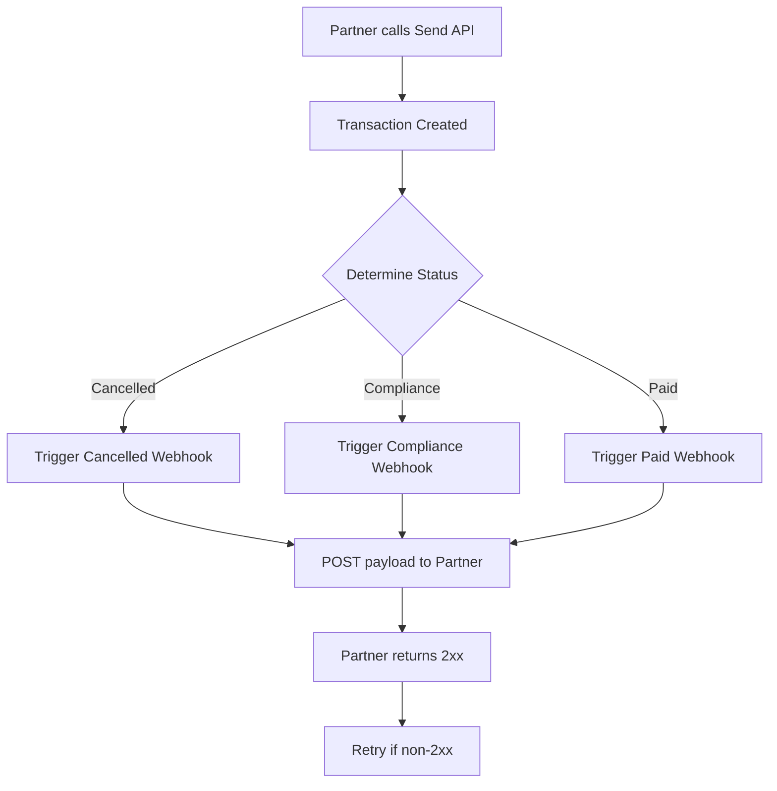

# Overview

### Business Context

Our **Partner** integrates with our platform by calling the **Send API** to create a payout transaction. Once the transaction is created, our system processes it and updates its status. The possible statuses that trigger a webhook back to the partner are:

- **Cancelled** – the transaction was aborted on our side.
- **Compliance** – the transaction is held for compliance review. This can happen for several reasons, such as:
  - Politically Exposed Person (PEP) in the sender or beneficiary.
  - Duplicate transaction detection.
  - Any other regulatory or risk‑related flag.
- **Paid** – the transaction has been successfully settled.

Whenever the status changes to one of the above, we **POST** a webhook payload to the partner‑provided endpoint. The payload contains the transaction identifier, the new status, timestamps, and any relevant compliance notes.

### Flow Summary

1. **Partner → Send API** – Partner creates a transaction.
2. **Our System** processes the transaction and determines the status.
3. **Status Change** – On transition to *Cancelled*, *Compliance*, or *Paid*, we trigger the webhook.
4. **Webhook Call** – POST request to partner’s webhook URL with JSON payload.
5. **Partner Acknowledgement** – Partner returns a 2xx response; otherwise we retry according to the retry policy.

# Overview

### Business Context

Our **Partner** integrates with our platform by calling the **Send API** to create a payout transaction. Once the transaction is created, our system processes it and updates its status. The possible statuses that trigger a webhook back to the partner are:

- **Cancelled** – the transaction was aborted on our side.
- **Compliance** – the transaction is held for compliance review. This can happen for several reasons, such as:
  - Politically Exposed Person (PEP) in the sender or beneficiary.
  - Duplicate transaction detection.
  - Any other regulatory or risk‑related flag.
- **Paid** – the transaction has been successfully settled.

Whenever the status changes to one of the above, we **POST** a webhook payload to the partner‑provided endpoint. The payload contains the transaction identifier, the new status, timestamps, and any relevant compliance notes.

### Flow Summary

1. **Partner → Send API** – Partner creates a transaction.
2. **Our System** processes the transaction and determines the status.
3. **Status Change** – On transition to *Cancelled*, *Compliance*, or *Paid*, we trigger the webhook.
4. **Webhook Call** – POST request to partner’s webhook URL with JSON payload.
5. **Partner Acknowledgement** – Partner returns a 2xx response; otherwise we retry according to the retry policy.

The diagram below visualises this flow:

---

*Document prepared by the Business Analyst team.*

---

*Document prepared by the Business Analyst team.*
