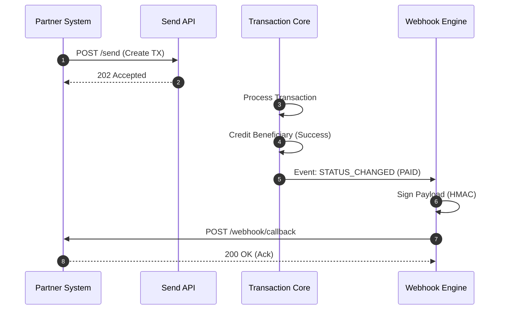
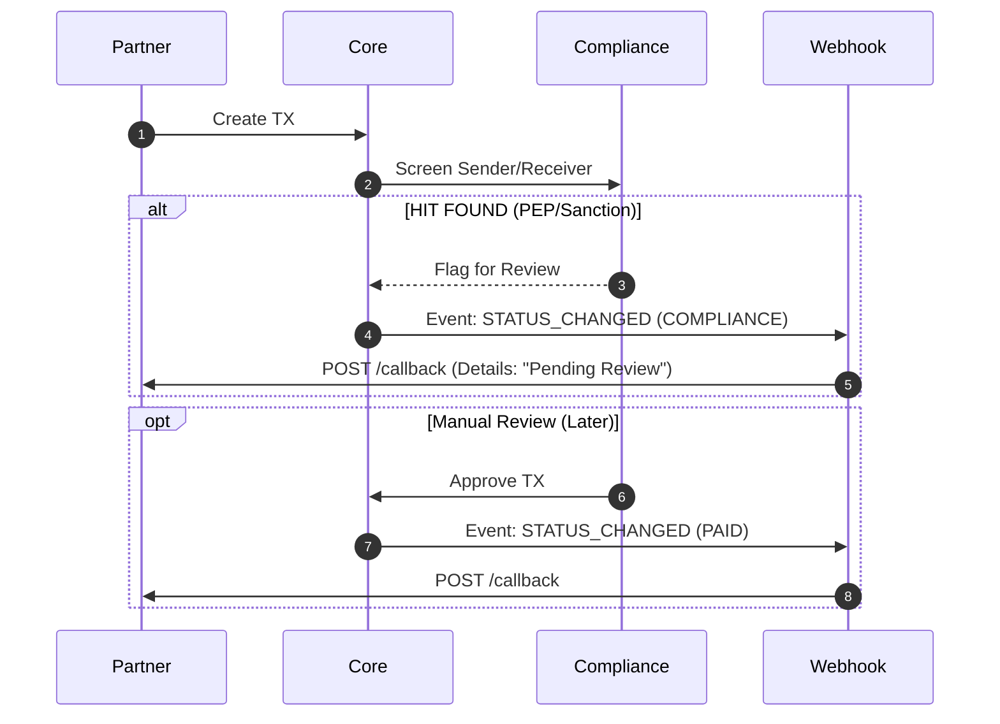
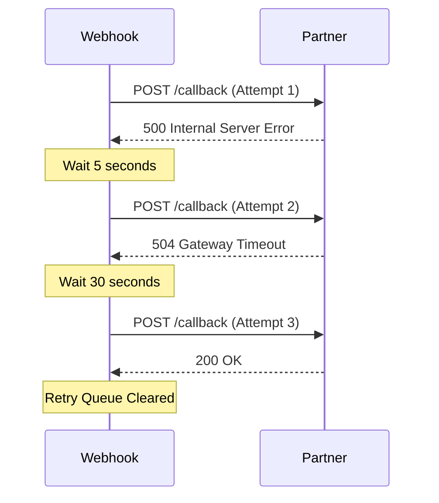

# Event Workflows

## 1. Happy Path: Transaction Paid

This flow illustrates the standard payout lifecycle where the transaction goes straight to completion.

## 2. Compliance Hold Path

This flow shows what happens when a transaction is flagged for review.

## 3. Retry Logic (Resilience)

This flow demonstrates the exponential backoff mechanism when the partner's server is down.

